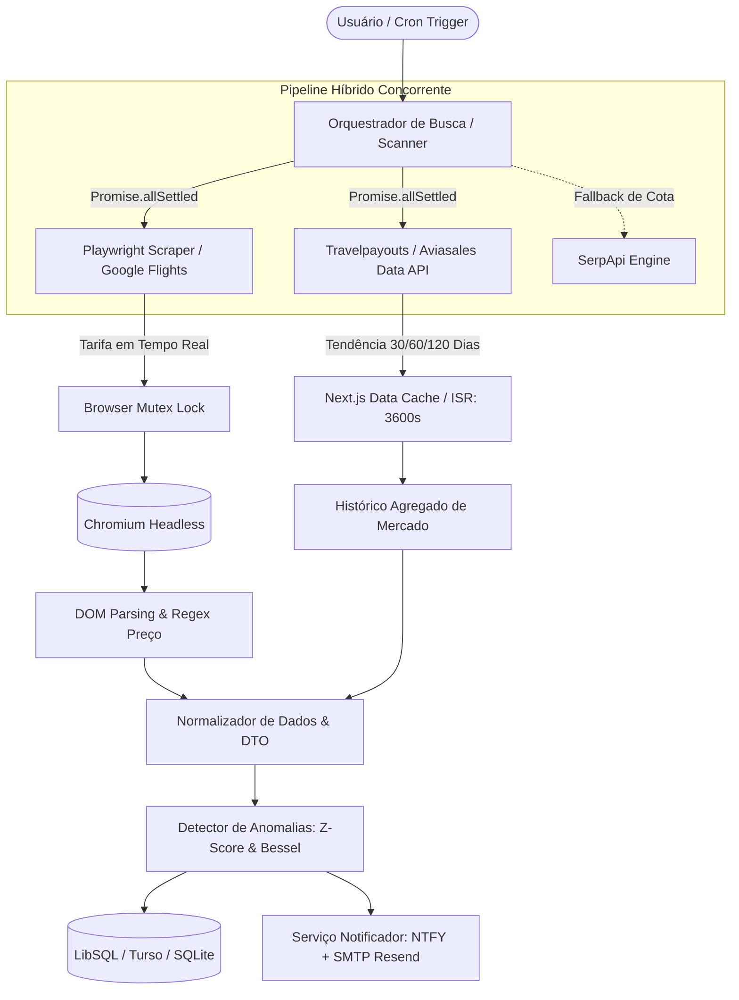
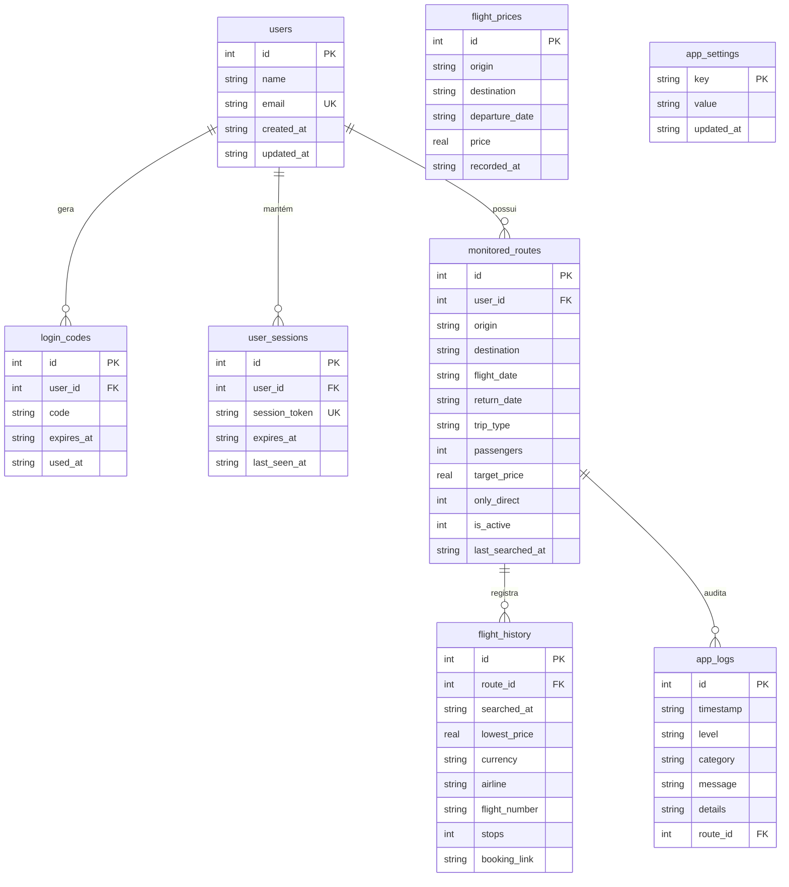

# BipFly — Documentação Técnica & Arquitetura de Software

> **Documento de Referência Arquitetural e Engenharia de Software**  
> **Versão:** 1.0.0  
> **Status:** Produção / Ativo  
> **Público-alvo:** Engenheiros de Software, Arquitetos de Soluções, Tech Leads e Avaliadores Técnicos.

---

## Sumário Executivo

O **BipFly** é uma plataforma avançada de inteligência tarifária e monitoramento contínuo de passagens aéreas. A aplicação monitora flutuações de preços diretamente no ecossistema do **Google Flights**, emprega análise estatística para detectar anomalias de preço (promoções reais calculadas via Z-Score) e dispara alertas multicanal automatizados (Push via NTFY e E-mail transacional) assim que tarifas atingem metas predefinidas.

Este documento consolida toda a arquitetura da solução, desde o design de pipelines concorrentes de dados (Web Scraping com Playwright e APIs de Afiliados Travelpayouts) até a infraestrutura de deploy em contêineres e modelos de persistência serverless.

---

## 1. Visão Geral do Produto (Executive Summary)

### 1.1. O Problema de Mercado
O mercado de passagens aéreas opera sob algoritmos opacos de precificação dinâmica (*dynamic pricing*). Companhias aéreas ajustam tarifas múltiplas vezes ao dia com base em demanda, perfil comportamental, antecedência de compra e capacidade ociosa de aeronaves. Para o consumidor, isso gera três fricções críticas:
1. **Assimetria de Informação:** Usuários desconhecem se um preço atual representa uma promoção legítima ou apenas uma flutuação sazonal padrão.
2. **Custo de Oportunidade e Tempo:** Acompanhar manualmente múltiplos trechos exige dezenas de consultas diárias no Google Flights.
3. **Janelas Curtas de Compra:** Quedas repentinas de tarifas (*fare drops* ou tarifas de erro) duram frequentemente poucas horas antes de esgotarem.

### 1.2. A Proposta de Valor do BipFly
O BipFly opera como um agente autônomo de inteligência de compras aéreas:
- **Monitoramento 24/7 de Alta Fidelidade:** Executa varreduras programadas no Google Flights com granularidade configurável (ex: a cada 3 horas).
- **Detecção Estatística de Oportunidades:** Utiliza o histórico de cotações para calcular a média e desvio padrão amostral com correção de Bessel ($N-1$). Desvios significativos ($Z \le -1.5$ e $Z \le -2.0$) são automaticamente categorizados como *Oportunidade* ou *Imperdível*.
- **Alertas Proativos em Tempo Real:** Disparo imediato de notificações sem dependência de intervenção humana.
- **Monetização Sustentável:** Incorporação de deep links monetizados com ID de afiliado Travelpayouts (`marker=780599`), gerando receita por conversão de reservas.

---

## 2. Arquitetura de Dados Híbrida (Hybrid Data Pipeline)

O cerne da engenharia do BipFly reside em sua arquitetura de ingestão híbrida, combinando **Web Scraping Headless de Primeira Parte** com **APIs de Dados Históricos de Terceiros**.



### 2.1. Ingestão em Tempo Real: Web Scraping com Playwright
- **Motor:** Playwright executando Chromium no modo headless otimizado.
- **Localização:** `src/lib/scrapers/google-flights-scraper.ts` e `src/lib/scanner.ts`.
- **Estratégia de Scraping:**
  - Gera URLs diretas de busca do Google Flights contendo parâmetros IATA normalizados, moeda em BRL (`curr=BRL`) e localização brasileira (`hl=pt-BR`).
  - Aguarda o carregamento dos seletores essenciais de listagem de voos com tempos limites estritos.
  - Extrai simultaneamente tarifas, companhias aéreas operadoras, horários de partida/chegada, tempo total de voo, número de escalas e links diretos de reserva.
  - Implementa algoritmo customizado de parsing de moeda (`parseBrazilianPrice`), capaz de tratar variações de pontuação decimal e milhar (padrão brasileiro `1.299,00` vs americano `1,299.00`).

### 2.2. Ingestão Histórica: Aviasales / Travelpayouts Data API
- **Endpoint:** `https://api.travelpayouts.com/v2/prices/latest`
- **Finalidade:** Fornecer dispersão e tendências de preço dos últimos 30 a 120 dias sem onerar o scraper em tempo real com dezenas de requisições retrospectivas.
- **Estratégia de Cache e Cota:**
  - Utiliza o motor de cache nativo do Next.js via Fetch com ISR: `{ next: { revalidate: 3600 } }`.
  - Garante resposta sub-100ms para consultas repetidas na mesma rota, respeitando os rate limits do parceiro de dados.

### 2.3. Resiliência, Isolamento e Fallback Strategy
1. **Execução Concorrente com `Promise.allSettled`:**
   A orquestração não utiliza `Promise.all`. Caso o scraper do Google Flights sofra timeout ou enfrente bloqueio temporário, a consulta não lança exceção 500: os dados históricos da Aviasales continuam sendo entregues ao usuário, acompanhados de estado de erro isolado para a cotação ao vivo. O mesmo ocorre no sentido inverso.
2. **Fallback para SerpApi:**
   Nas configurações da aplicação (`src/lib/flight-tracker.ts`), existe a opção de chave de contingência SerpApi (`search_provider: 'auto' | 'scraper' | 'serpapi'`). Se ativado o modo fallback, falhas consecutivas do Chromium comutam dinamicamente a coleta para a Google Flights Engine da SerpApi.
3. **Browser Mutex (`withBrowserLock`):**
   Ambientes com recursos computacionais enxutos (ex: contêineres Railway com 512MB-1GB de RAM) sofrem *Out-Of-Memory (OOM)* se múltiplas instâncias de navegadores forem instanciadas em paralelo. Foi implementado um semáforo assíncrono via `Promise` encadeada (`withBrowserLock`), garantindo fila ordenada estrita: exatamente **uma única instância do Chromium** acessa a CPU/RAM por vez.
4. **Otimização Extrema de Argumentos do Chromium:**
   O navegador é inicializado com flags focadas em economia de hardware e contenção de vazamentos:
   ```typescript
   "--no-sandbox",
   "--disable-setuid-sandbox",
   "--disable-dev-shm-usage",
   "--disable-gpu",
   "--disable-software-rasterizer",
   "--disable-extensions",
   "--no-zygote",
   "--disable-blink-features=AutomationControlled",
   "--window-size=1024,600"
   ```
   Inclui lógica de *retry* com invocação manual de `global.gc()` quando o Node.js expõe a flag de garbage collection.

---

## 3. Fluxos de Navegação e Funcionalidades do Usuário

### 3.1. Busca e Comparação de Voos
- **Filtros Estritos de Aeroporto:** O algoritmo valida se o resultado retornado pelo Google Flights corresponde rigidamente à sigla IATA de origem e destino solicitada, descartando aeroportos metropolitanos vizinhos indesejados (`nearby airports`).
- **Segregação Direto vs. Conexão:** Classifica as opções entre voos sem escalas e voos com conexões, permitindo que rotas configuradas como "Apenas Diretos" rejeitem voos mais baratos que possuam paradas indesejadas.
- **Composição de Passageiros:** Suporta adultos (12+ anos), crianças (2-11 anos) e bebês de colo (< 2 anos), além de fluxos *One-Way* (somente ida) e *Round-Trip* (ida e volta).

### 3.2. Histórico e Inteligência Tarifária (Z-Score & Bessel)
O motor estatístico (`src/lib/stats/flight-anomaly-detector.ts`) avalia cada nova cotação frente à distribuição histórica da rota:
- **Média Amostral:** $\bar{x} = \frac{1}{N} \sum_{i=1}^N x_i$
- **Variância Amostral (Correção de Bessel):** $s^2 = \frac{1}{N-1} \sum_{i=1}^N (x_i - \bar{x})^2$
- **Desvio Padrão Amostral:** $s = \sqrt{s^2}$
- **Z-Score do Preço Atual:** $Z = \frac{x_{\text{atual}} - \bar{x}}{s}$

#### Classificação de Tarifas:
| Classificação | Condição Matemática | Ação do Sistema |
| :--- | :--- | :--- |
| **NORMAL** | $Z > -1.5$ | Preço dentro da variabilidade esperada. Salva histórico; nenhum alerta prioritário. |
| **OPORTUNIDADE** | $-2.0 < Z \le -1.5$ com $N \ge 3$ | Queda relevante abaixo da média. Dispara tag visual e alerta destacado. |
| **IMPERDÍVEL** | $Z \le -2.0$ com $N \ge 3$ | Anomalia de alta intensidade (mais de 2 desvios padrão abaixo). Dispara notificação prioritária. |

A visualização histórica é renderizada através do **Recharts**, permitindo alternar entre gráficos de evolução temporal e distribuição de preços mínimos.

### 3.3. Sistema de Alertas e Monitoramento Automatizado
- **Agendador Integrado (`node-cron` + `instrumentation.ts`):** O Next.js utiliza o hook de runtime `register()` do arquivo `instrumentation.ts` para subir o daemon de agendamento em segundo plano sem necessidade de workers externos dedicados.
- **Intervalos Customizáveis:** As horas de varredura são configuradas via string padrão cron ou lista delimitada por vírgulas (ex: `00:00,03:00,06:00,09:00,12:00,15:00,18:00,21:00`).
- **Canais de Disparo:**
  1. **NTFY Push Notifications:** Envio para tópicos customizáveis no gateway `ntfy.sh`, permitindo alertas sonoros no celular e desktop.
  2. **E-mails Transacionais (SMTP / Resend):** Templates HTML responsivos (`src/lib/email.ts`) com detalhamento completo da economia (R$ e %), dados de escala, companhia aérea e botão de ação direta.

### 3.4. Redirecionamento Monetizado & Deep Linking
- **Marker de Afiliado `780599`:** Todos os links de conversão gerados para parceiros e agregadores anexam obrigatoriamente a flag de afiliação (`marker=780599`).
- **Travelpayouts Drive:** Injetado via `next/script` no layout raiz (`src/app/layout.tsx`), validando o domínio `bipfly.app` e rastreando cliques de conversão sem bloquear a hidratação da página.

---

## 4. Stack Tecnológica & Decisões de Engenharia

```mermaid
graph LR
    subgraph Frontend [Camada de Apresentação]
        NextApp[Next.js 16 App Router]
        React19[React 19 Server/Client Components]
        Tailwind[Tailwind CSS v4]
        Recharts[Recharts Data Visualizations]
        Lucide[Lucide React Icons]
    end

    subgraph State_Contexts [Estado Global & Contextos]
        ScanCtx[ScanningProvider]
        AuthCtx[AuthProvider]
        LangCtx[LanguageProvider]
        ToastCtx[ToastProvider]
    end

    subgraph Core_Backend [Camada de Servidor & Engine]
        RouteHandlers[Next.js API Route Handlers]
        Playwright[Playwright Chromium Scraper]
        Scheduler[Node-Cron Scheduler Engine]
        StatsEngine[Anomaly & Z-Score Engine]
    end

    subgraph Data_Storage [Persistência & Infra]
        LibSQLClient[@libsql/client Driver]
        TursoCloud[(Turso Serverless Cloud)]
        SQLiteLocal[(SQLite Local Database)]
        Docker[Docker Container / Railway PaaS]
    end

    Frontend --> State_Contexts
    State_Contexts --> Core_Backend
    Core_Backend --> Data_Storage
```

### 4.1. Frontend & Renderização Híbrida
- **Next.js 16 (App Router):** Roteamento baseado em pastas com separação limpa entre componentes de servidor (renderização rápida de cascas estáticas e SEO) e componentes clientes interativos.
- **React 19:** Utilização de hooks modernos (`useCallback`, `useMemo`, `useTransition`) para manuseio otimizado do ciclo de vida da interface.
- **Tailwind CSS v4:** Motor CSS sem arquivos de configuração legados pesados, aproveitando a nova engine baseada em variáveis CSS nativas e desempenho extremo de build.

### 4.2. Contextos Reativos e Gerenciamento de Estado
1. **`ScanningProvider` (`src/context/ScanningContext.tsx`):**
   - Controla o estado de varredura ativo na aplicação.
   - Fornece um contador de tempo decorrido em tempo real (`elapsedSeconds`), indicadores visuais no cabeçalho/rodapé e mecanismo de broadcast via *callbacks* inscritos (`registerRefreshCallback`), garantindo que listas de rotas e métricas se atualizem instantaneamente após o término de um scan.
2. **`AuthProvider` (`src/lib/auth/AuthContext.tsx`):**
   - Gerencia a autenticação *passwordless* (código OTP de 6 dígitos enviado por e-mail).
   - Sessões mantidas via cookie HTTP-Only (`session_token`), criptograficamente seguro (`crypto.randomBytes(32)`), com expiração de 60 dias e proteção `SameSite=lax`.
   - Suporte a **Progressive Profiling**: usuários podem cadastrar uma rota na home preenchendo apenas nome e e-mail; o sistema autentica a sessão automaticamente sem exigir redirecionamentos que quebrem o fluxo de onboarding.
3. **`LanguageProvider` (`src/lib/i18n/context.tsx`):**
   - Suporte bilíngue nativo (`pt-BR` e `en-US`).
   - Formatação monetária inteligente: exibe valores em Real Brasileiro (BRL) e calcula dinamicamente estimativas em Dólar Americano (USD) utilizando taxa cambial ajustável.

### 4.3. Persistência Poliglota com LibSQL / Turso
- O conector de banco de dados (`src/lib/db.ts`) emprega o driver unificado `@libsql/client`.
- **Flexibilidade Híbrida:**
  - Em ambiente local ou desenvolvimento: conecta a arquivo SQLite local (`file:radar_passagens.db`).
  - Em produção (Railway): caso configuradas as variáveis `TURSO_DATABASE_URL` e `TURSO_AUTH_TOKEN`, o conector direciona as operações transparentemente para o banco de dados serverless distribuído no Turso Cloud (LibSQL over HTTP).
- **Auto-migração de Schema:** Função `initSchema()` garante idempotência na criação de tabelas, índices e inserção de configurações operacionais padrão (`INSERT OR IGNORE`).

### 4.4. Modelo Entidade-Relacionamento



---

## 5. Infraestrutura, Deploy & Segurança

### 5.1. Contêiner Docker Otimizado para Railway
O contêiner oficial utiliza imagem base `node:22-bookworm-slim` projetada especificamente para suportar o ecossistema do Playwright em ambiente Linux com baixo consumo de disco:
```dockerfile
FROM node:22-bookworm-slim
WORKDIR /app

# Dependências nativas essenciais para compilação e certificados TLS
RUN apt-get update && apt-get install -y --no-install-recommends \
    ca-certificates curl git python3 make g++ \
    && rm -rf /var/lib/apt/lists/*

COPY package.json yarn.lock ./
RUN yarn install --frozen-lockfile

# Instalação controlada dos binários do Chromium e bibliotecas compartilhadas do SO
RUN npx playwright install --with-deps chromium

COPY . .
ENV NEXT_TELEMETRY_DISABLED=1
ENV NODE_ENV=production
RUN yarn build

EXPOSE 3000
CMD ["yarn", "start"]
```

### 5.2. Segurança e Boas Práticas
- **Zero API Keys no Bundle do Cliente:** Todas as chaves sensíveis (`TURSO_AUTH_TOKEN`, `TRAVELPAYOUTS_API_TOKEN`, `SERPAPI_API_KEY`, credenciais SMTP) são acessadas estritamente em Server Components ou Route Handlers do servidor.
- **Validação e Sanitização de Entradas:** Módulo `src/lib/validation.ts` com validação de expressões regulares para nomes completos, formato de e-mail RFC 5322 e códigos IATA.
- **Auditoria Estruturada:** Módulo `logger` escreve logs unificados no stdout e insere eventos críticos na tabela `app_logs`, permitindo inspeção visual na rota `/logs` com filtros por nível (`INFO`, `SUCCESS`, `WARN`, `ERROR`) e categoria (`SCRAPER`, `SCANNER`, `API`, `SCHEDULER`, `NOTIFIER`, `SYSTEM`).

---

## 6. Guia para Entrevistas Técnicas (System Design & Behavioral Q&A)

Esta seção foi desenhada para servir de consulta rápida e preparação para sabatinas técnicas e discussões de arquitetura.

### P1: "Por que vocês optaram por Web Scraping com Playwright em vez de utilizar apenas APIs comerciais de passagens?"
> **Resposta Esperada:**  
> "APIs consolidadas de passagens aéreas (como Amadeus Enterprise ou Sabre) exigem aprovações burocráticas complexas, impõem custos proibitivos por requisição e frequentemente possuem acordos tarifários que não refletem promoções exclusivas da web. O Google Flights é a fonte canônica mais atualizada de tarifas globais. Desenvolvemos o scraper com Playwright para obter tarifas brutas em tempo real com fidelidade máxima. Para mitigar o custo computacional do scraping contínuo, implementamos uma **arquitetura híbrida**: usamos o Playwright para a busca imediata e a Travelpayouts/Aviasales Data API para compor tendências históricas agregadas com cache de 1 hora no Next.js."

### P2: "Como vocês resolveram o risco de exaustão de memória (OOM) no servidor ao rodar Chromium em produção?"
> **Resposta Esperada:**  
> "O Chromium é intensivo em memória. Em contêineres PaaS como o Railway, se três requisições disparassem navegadores em paralelo, o contêiner morreria por OOM. Resolvemos isso em três frentes:
> 1. **Mutex Lock Assíncrono:** Criamos um semáforo de execução em memória (`withBrowserLock`) que enfileira as varreduras, garantindo que no máximo uma única instância de navegador execute por vez.
> 2. **Flags de Baixo Footprint:** Desativamos GPU, memória compartilhada de desenvolvimento (`--disable-dev-shm-usage`), zygote, extensões e travamos a viewport em 1024x600.
> 3. **Isolamento de Ciclo de Vida:** O navegador é instanciado pontualmente para o lote, fechado no bloco `finally`, e o coletor de lixo do Node.js é acionado em caso de retry."

### P3: "Por que usar Z-Score com Correção de Bessel para alertas em vez de uma simples porcentagem fixa de desconto?"
> **Resposta Esperada:**  
> "Uma regra estática como 'avisar se cair 20%' falha em rotas de alta volatilidade natural (onde 20% é oscilação comum) e ignora rotas estáveis (onde uma queda de 8% já é uma anomalia expressiva). O Z-Score normaliza o preço atual em termos de desvios padrão em relação à média histórica daquela rota específica. A correção de Bessel ($N-1$) é mandatória porque trabalhamos com **amostras** de cotações, e não com a população universal de preços, corrigindo o viés de subestimação da variância em amostras pequenas. Estabelecemos o limiar de $Z \le -2.0$ para classificar como 'Imperdível', garantindo precisão estatística e evitando fadiga de alertas no usuário."

### P4: "Como foi tratada a persistência de dados considerando facilidade de desenvolvimento e escalabilidade em nuvem?"
> **Resposta Esperada:**  
> "Adotamos o `@libsql/client`, que provê interoperabilidade total entre o SQLite local em arquivo e a nuvem distribuída do Turso. Em desenvolvimento local, o time roda zero infraestrutura externa (apenas o arquivo `.db`). Em produção, alternando apenas duas variáveis de ambiente (`TURSO_DATABASE_URL` e `TURSO_AUTH_TOKEN`), a aplicação passa a persistir em réplicas globais do Turso via HTTP sem que nenhuma linha de consulta SQL precise ser refatorada."

### P5: "Qual foi a estratégia de monetização e atribuição adotada na aplicação?"
> **Resposta Esperada:**  
> "Implementamos o modelo de afiliação Travelpayouts / Aviasales. Integramos o script Travelpayouts Drive no `RootLayout` via `next/script` com estratégia `afterInteractive` para verificação de propriedade do domínio `bipfly.app`. Nos resultados de voos, todos os links diretos para plataformas de emissão recebem injeção do parâmetro `marker=780599`. Assim, todo o tráfego gerado pela inteligência tarifária do BipFly é comissionado quando o usuário finaliza a compra no parceiro."
