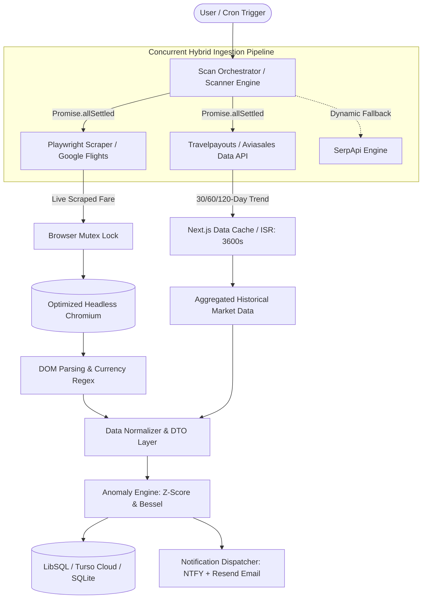
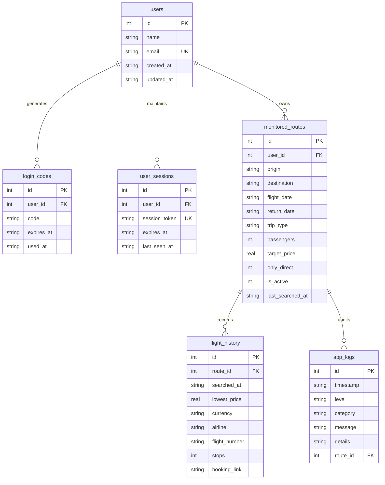

# BipFly — Flight Fare Intelligence & Autonomous Price Monitoring Platform

<p align="center">
  
</p>

<p align="center">
  <strong>Autonomous data engineering and real-time flight fare monitoring platform featuring statistical anomaly detection (Z-Score & Bessel's Correction), hybrid ingestion pipelines, and multi-channel alerting.</strong>
</p>

<p align="center">
  
  
  
  
  
  
  
  
</p>

---

## 🎯 Executive Summary & Market Problem

The commercial airline industry operates under aggressive, opaque **dynamic pricing** algorithms. Airlines adjust ticket prices dozens of times per day based on real-time seat inventory, route demand, seasonality, and user browsing history. This creates three critical friction points for travelers:

1. **Information Asymmetry:** Consumers cannot tell whether a price drop represents a genuine bargain or merely standard baseline fluctuation.
2. **Opportunity Cost & Cognitive Load:** Tracking flight routes manually requires repetitive daily searches across Google Flights.
3. **Fleeting Booking Windows:** Significant fare drops and error fares often vanish within hours before travelers can spot them.

**BipFly** was engineered as an autonomous fare monitoring agent. The application tracks routes 24/7 directly on **Google Flights**, normalizes historical fare distributions, applies **statistical anomaly detection with Bessel's correction ($N-1$) and Z-Score**, and immediately dispatches multi-channel alerts via **Push Notifications (NTFY)** and **Transactional HTML Email**.

---

## 🏗️ System Architecture

The solution was built with strict modularity, concurrency control, and fault tolerance against rate limits and network degradation.



---

## ⚡ Core Engineering Highlights & Key Differentiators

### 1. Hybrid Data Ingestion Pipeline with Fault Isolation
- **First-Party Playwright Scraper:** Directly extracts live flight data from Google Flights using normalized IATA parameters, Brazilian localization (`hl=pt-BR`), and local currency (`curr=BRL`). Captures departure/arrival times, stops, flight numbers, operating carriers, and deep booking URLs.
- **Aviasales / Travelpayouts Data API:** Fetches historical 30- to 120-day price trend aggregations. Leverages Next.js native fetch cache with ISR (`{ next: { revalidate: 3600 } }`), delivering sub-100ms response times for recurring route queries.
- **Resilience via `Promise.allSettled`:** Scraper timeouts or temporary rate limits never trigger HTTP 500 errors; the system delivers cached historical trends alongside an isolated error state for live pricing.

### 2. Concurrency Safety & Out-Of-Memory (OOM) Prevention
- **In-Memory Browser Mutex (`withBrowserLock`):** On memory-constrained Linux containers (e.g., 512MB-1GB RAM on Railway), running multiple Chromium instances concurrently triggers immediate container termination by the OS OOM killer. An asynchronous semaphore queue (`Promise`) ensures **strictly one Chromium instance operates at any given time**.
- **Chromium Footprint Optimization:** Runs without sandboxes, disables GPU rasterization, disables `/dev/shm` shared memory, disables zygote processes, and locks the viewport to 1024x600. Resources are closed cleanly in `finally` blocks, with manual `global.gc()` invocations on retry cycles.

### 3. Statistical Anomaly Detection (Z-Score + Bessel's Correction)
Rather than relying on naive arbitrary percentage thresholds (e.g., "alert if price drops by 15%"), BipFly computes the **Z-Score** of every new quote against the route's historical price distribution:

$$\bar{x} = \frac{1}{N} \sum_{i=1}^N x_i \quad \Bigg| \quad s = \sqrt{\frac{1}{N-1} \sum_{i=1}^N (x_i - \bar{x})^2} \quad \Bigg| \quad Z = \frac{x_{\text{current}} - \bar{x}}{s}$$

- **NORMAL ($Z > -1.5$):** Fare lies within expected market volatility. Persisted to history; no disruptive alert triggered.
- **OPPORTUNITY ($-2.0 < Z \le -1.5$ with $N \ge 3$):** Drop exceeds 1.5 standard deviations below historical mean. Highlighted in UI and flagged as high-value deal.
- **UNMISSABLE ($Z \le -2.0$ with $N \ge 3$):** Statistical anomaly (over 2 standard deviations below mean). Triggers immediate priority push notification and transactional email.
- **Why Bessel's Correction ($N-1$)?** The monitoring engine evaluates a statistical **sample** of observed quotes, not the universal population of all past prices. Applying $N-1$ corrects sample variance underestimation, preventing false positive alerts during early route monitoring cycles.

### 4. Passwordless Authentication & Progressive Profiling
- **Frictionless Auth:** 6-digit OTP delivered via email, eliminating brute-force credential attacks and reducing cognitive onboarding friction.
- **Cryptographically Secure Sessions:** Persisted via `HTTP-Only`, `SameSite=Lax` cookies generated via `crypto.randomBytes(32)` with 60-day expiration.
- **Progressive Profiling:** First-time visitors can create and start monitoring a route by providing only their name and email; the platform provisions their account and establishes a session in the background without breaking the flow.

### 5. Polyglot Persistence with LibSQL / Turso
- Built on `@libsql/client` for zero-configuration portability:
  - **Local Development:** Connects seamlessly to a local SQLite file (`file:radar_passagens.db`).
  - **Production Environment:** Points transparently to a distributed serverless Turso Cloud cluster (LibSQL over HTTP) by toggling two environment variables, requiring zero SQL query refactoring.
- **Idempotent Auto-Migration:** Self-executing schema initialization (`initSchema()`) verifies tables, indices, and defaults on startup.

### 6. Observabilidade & Structured Audit Logging
- Structured database logging (`app_logs`) with full inspection capabilities at `/logs`.
- Audited subsystems: `SCRAPER`, `SCANNER`, `API`, `SCHEDULER`, `NOTIFIER`, and `SYSTEM`.
- Real-time reactive scanning context (`ScanningProvider`) with live elapsed time counters (`elapsedSeconds`) and automated UI revalidation.

---

## 🛠️ Technology Stack

| Layer | Technology | Architectural Rationale |
| :--- | :--- | :--- |
| **Framework** | [Next.js 16](https://nextjs.org/) (App Router) | Hybrid rendering (Server/Client Components), route handlers, and server actions. |
| **Language** | [TypeScript 5](https://www.typescriptlang.org/) | End-to-end static type safety and domain modeling. |
| **UI Library** | [React 19](https://react.dev/) | Modern hooks (`useTransition`, `useActionState`), concurrent rendering. |
| **Styling** | [Tailwind CSS v4](https://tailwindcss.com/) | Next-generation engine with native CSS variables and rapid build times. |
| **Data Visualization** | [Recharts](https://recharts.org/) | Interactive price trend charts, volatility curves, and historical distributions. |
| **Headless Browser** | [Playwright](https://playwright.dev/) | Full automation of Chromium to interact with client-side SPA price aggregators. |
| **Scheduler** | [node-cron](https://www.npmjs.com/package/node-cron) + `instrumentation.ts` | In-process daemon executing background scans without external workers. |
| **Database** | [Turso](https://turso.tech/) / [LibSQL](https://github.com/tursodatabase/libsql) | Distributed serverless SQLite with local file compatibility. |
| **Alerts & Emails** | [NTFY](https://ntfy.sh/) & [Resend](https://resend.com/) | Real-time push notifications (mobile/desktop) and responsive HTML emails. |
| **Containerization** | [Docker](https://www.docker.com/) (`node:22-bookworm-slim`) | Slim Linux image bundled with native system libraries for Chromium. |

---

## 🗄️ Entity-Relationship Diagram (ERD)



---

## 🚀 Getting Started & Local Development

### Prerequisites
- **Node.js:** Version 20.x or higher (Node 22 recommended).
- **Package Manager:** `yarn` or `npm`.
- **Browser Binaries:** Chromium browser binaries installed via Playwright.

### Quick Start

1. **Clone the repository:**
   ```bash
   git clone https://github.com/your-username/monitorar-passagens.git
   cd monitorar-passagens
   ```

2. **Install project dependencies:**
   ```bash
   yarn install
   ```

3. **Install Chromium browser binaries for Playwright:**
   ```bash
   npx playwright install chromium
   ```

4. **Configure environment variables:**
   ```bash
   cp .env.example .env.local
   ```

5. **Start the development server:**
   ```bash
   yarn dev
   ```
   Open [http://localhost:3000](http://localhost:3000) in your browser. The local SQLite database (`radar_passagens.db`) is automatically initialized and migrated on the first request.

---

## ⚙️ Environment Variables Reference

| Variable | Required | Default | Description |
| :--- | :---: | :---: | :--- |
| `TURSO_DATABASE_URL` | No | *Empty (uses local SQLite)* | Connection string for Turso Cloud (e.g., `libsql://your-db.turso.io`). |
| `TURSO_AUTH_TOKEN` | No | *Empty* | Authentication JWT token for Turso Cloud. |
| `RESEND_API_KEY` | No | *Empty (logs to console in dev)* | API key for Resend to send transactional emails and OTP codes. |
| `EMAIL_FROM` | No | `BipFly <alerts@notify.bipfly.app>` | Sender address for transactional emails. |
| `NTFY_TOPIC` | No | `radar-passagens` | Target topic name on [ntfy.sh](https://ntfy.sh) for Web Push notifications. |
| `SCHEDULE_HOURS` | No | `00:00,03:00,06:00,09:00,12:00,15:00,18:00,21:00` | Comma-delimited list of hours (HH:MM) to run automated background scans. |
| `SERPAPI_API_KEY` | No | *Empty* | Contingency API key for Google Flights fallback if Chromium scraping is blocked. |
| `ADMIN_EMAILS` | No | *Empty* | Comma-separated list of administrative emails with unlimited route privileges. |
| `FEATURE_UNLIMITED_ROUTES` | No | `false` | Feature flag to bypass per-user route creation limits. |
| `TRAVELPAYOUTS_MARKER` | No | `780599` | Affiliate marker ID appended to booking deep links for monetization. |

---

## 🐳 Docker Deployment

The application includes a production-ready `Dockerfile` based on `node:22-bookworm-slim`, packaging all necessary Linux shared libraries, fonts, and certificates required to run headless Chromium smoothly.

### Build Docker Image
```bash
docker build -t bipfly:latest .
```

### Run Container
```bash
docker run -p 3000:3000 \
  -e TURSO_DATABASE_URL="your_turso_url" \
  -e TURSO_AUTH_TOKEN="your_turso_token" \
  -e RESEND_API_KEY="your_resend_key" \
  bipfly:latest
```

---

## 🧠 Architectural Q&A (Tech Lead & CTO Perspective)

<details>
<summary><strong>1. Why use Playwright-based Web Scraping instead of relying solely on flight aggregation APIs?</strong></summary>
<br />
Commercial flight APIs (such as Amadeus Enterprise or Sabre) require complex enterprise agreements, impose prohibitive per-query costs, and often omit web-exclusive discounted fares. Google Flights serves as the most comprehensive, up-to-date global index of airfare prices. Playwright extracts raw fares with maximum accuracy. To mitigate server load and execution duration, we established a <strong>hybrid architecture</strong>: Playwright performs targeted live price lookups, while the Aviasales / Travelpayouts Data API supplies broad historical curves cached with Next.js ISR (1-hour TTL).
</details>

<details>
<summary><strong>2. How did you mitigate Out-Of-Memory (OOM) crashes when running Chromium on small containers?</strong></summary>
<br />
Chromium is notoriously memory-heavy. In lightweight PaaS containers (such as Railway instances with 512MB RAM), parallel search requests spinning up multiple browser instances would immediately trigger OOM termination. We resolved this via three safeguards:
<ol>
  <li><strong>Asynchronous Browser Mutex (<code>withBrowserLock</code>):</strong> An in-memory promise queue serializes scraping tasks, ensuring exactly <em>one browser instance executes at a time</em>.</li>
  <li><strong>Minimal Footprint Flags:</strong> Chromium launches with hardware acceleration disabled, no sandboxing, no zygote, disabled shared memory (<code>--disable-dev-shm-usage</code>), and a locked 1024x600 viewport.</li>
  <li><strong>Strict Lifecycle Cleanup:</strong> Browsers are instantiated per batch and closed inside <code>finally</code> blocks, triggering garbage collection (<code>global.gc()</code>) on retries.</li>
</ol>
</details>

<details>
<summary><strong>3. Why use Z-Score with Bessel's Correction rather than a static discount percentage?</strong></summary>
<br />
Static rules like "alert when price drops by 20%" fail across diverse flight routes: on highly volatile routes, a 20% swing is normal (causing alert fatigue from false positives); on steady business routes, an 8% drop might be a once-in-a-season anomaly. The Z-Score normalizes fluctuations relative to each route's historical variance. <strong>Bessel's Correction ($N-1$)</strong> is mathematically necessary because the engine operates on <em>sample</em> observations rather than the universal population of all past quotes, eliminating the negative bias in sample variance estimation.
</details>

<details>
<summary><strong>4. How is internationalization and currency conversion handled?</strong></summary>
<br />
BipFly features a bilingual i18n engine (<code>src/lib/i18n</code>) supporting Brazilian Portuguese (<code>pt-BR</code>) and US English (<code>en-US</code>). Prices are stored in Brazilian Reais (BRL) as the canonical currency and dynamically estimated in USD in the presentation layer using live conversion rates, preventing redundant database rows.
</details>

---

## 📁 Repository Structure

```text
├── src/
│   ├── app/                      # Next.js App Router (Pages, Layouts & Route Handlers)
│   │   ├── api/                  # REST APIs (Auth, Routes, Scheduler, Scraper, Settings)
│   │   ├── dashboard/            # Core dashboard displaying route KPIs and metrics
│   │   ├── history/              # Price history visualization and volatility charts
│   │   ├── logs/                 # Structured audit trail and system logging console
│   │   ├── routes/               # Route management and filter settings
│   │   ├── settings/             # Configuration console (Cron, APIs, Notification keys)
│   │   ├── layout.tsx            # Root layout with providers and analytics guards
│   │   └── page.tsx              # Landing page featuring Progressive Profiling form
│   ├── components/               # Reusable UI components (Modals, Tables, Charts, Nav)
│   ├── context/                  # React Contexts (ScanningContext for execution state)
│   ├── lib/                      # Business logic, engines, and system core
│   │   ├── auth/                 # Authentication state and session cookie handlers
│   │   ├── i18n/                 # Localization dictionaries and currency utilities (PT/EN)
│   │   ├── scrapers/             # Playwright Google Flights web scraper
│   │   ├── stats/                # Statistical Anomaly Engine (Z-Score & Bessel's Correction)
│   │   ├── db.ts                 # LibSQL / Turso database client and idempotent schema
│   │   ├── email.ts              # Resend integration and responsive email templates
│   │   ├── flight-tracker.ts     # Search orchestrator and contingency fallback logic
│   │   ├── scanner.ts            # Route scan coordinator with Browser Mutex Lock
│   │   └── scheduler.ts          # node-cron automated execution daemon
│   ├── instrumentation.ts        # Node.js runtime initialization hook
│   └── types/                    # Domain TypeScript interfaces and types
├── openspec/                     # Formal OpenSpec change specifications and tasks
├── public/                       # Static public assets, icons, and SVG illustrations
├── Dockerfile                    # Production-ready container recipe with Chromium
├── package.json                  # Dependencies and build scripts
└── README.md                     # Project technical documentation
```

---

## 📄 License

This project is open-source and released under the [MIT License](LICENSE). Built for advanced technical demonstration, flight market intelligence, and software engineering portfolio evaluation.

<p align="center">
  Engineered with high standards of software craft, architectural resilience, and modern web paradigms.
</p>
